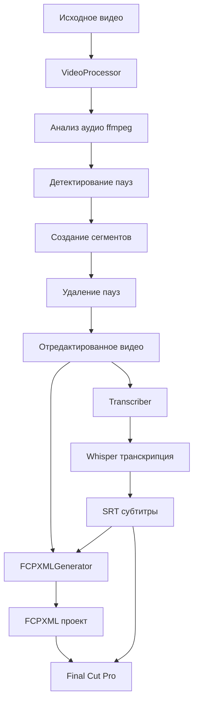

# 🏗️ Архитектура проекта

## Структура файлов

```
VideoRUBY/
├── video_editor_app.py      # Главное GUI приложение
├── video_processor.py        # Модуль обработки видео
├── transcription.py          # Модуль транскрипции
├── fcpxml_generator.py       # Генератор FCPXML
├── install.sh                # Скрипт установки
├── create_app.sh             # Создание .app
├── requirements.txt          # Python зависимости
├── README.md                 # Полная документация
├── QUICK_START.md            # Быстрый старт
├── EXAMPLES.md               # Примеры использования
└── ARCHITECTURE.md           # Этот файл
```

## Модули системы

### 1. video_processor.py
**Назначение**: Анализ и обработка видео

**Основные классы**:
- `VideoProcessor` - Главный класс обработки
- `Segment` - Представление сегмента видео

**Функциональность**:
- Детектирование пауз через ffmpeg silencedetect
- Создание сегментов (речь/пауза)
- Удаление пауз через ffmpeg concat
- Статистика обработки

**Зависимости**:
- ffmpeg (внешняя)
- Python subprocess

**API**:
```python
processor = VideoProcessor(silence_threshold_db=-35, min_silence_duration=0.5)
result = processor.process_video(video_path)
# result = {
#     'original_video': str,
#     'edited_video': str,
#     'segments': List[Segment],
#     'statistics': dict
# }
```

### 2. transcription.py
**Назначение**: Распознавание речи и генерация субтитров

**Основные классы**:
- `Transcriber` - Транскрипция через Whisper
- `SubtitleGenerator` - Генерация субтитров

**Функциональность**:
- Транскрипция через OpenAI Whisper
- Генерация SRT субтитров
- Корректировка временных меток
- Поддержка русского языка

**Зависимости**:
- openai-whisper (внешняя)
- Python subprocess

**API**:
```python
transcriber = Transcriber(model_size="base", language="ru")
subtitle_path = transcriber.transcribe(video_path, output_format="srt")

generator = SubtitleGenerator()
generator.generate_srt(subtitles, output_path)
```

### 3. fcpxml_generator.py
**Назначение**: Генерация FCPXML для Final Cut Pro

**Основные классы**:
- `FCPXMLGenerator` - Создание FCPXML файлов

**Функциональность**:
- Генерация FCPXML 1.11 формата
- Создание timeline с видео
- Добавление субтитров как титров
- Экспорт ссылок на видео и субтитры

**Зависимости**:
- Python xml.etree.ElementTree
- Python xml.dom.minidom

**API**:
```python
generator = FCPXMLGenerator(framerate="30000/1001")
generator.create_simple_fcpxml_with_srt(
    video_path,
    srt_path,
    output_path,
    project_name="My Project"
)
```

### 4. video_editor_app.py
**Назначение**: GUI приложение

**Основные классы**:
- `VideoEditorApp` - Главное окно приложения

**Функциональность**:
- Графический интерфейс через tkinter
- Выбор файлов
- Настройка параметров
- Прогресс обработки
- Лог операций

**Зависимости**:
- Python tkinter
- video_processor
- transcription
- fcpxml_generator

**Поток выполнения**:
1. Пользователь выбирает видео
2. Настраивает параметры
3. Нажимает "Обработать"
4. Запускается поток обработки:
   - Анализ пауз
   - Удаление пауз
   - Транскрипция
   - Генерация FCPXML
5. Результаты сохраняются

## Процесс обработки



## Технологический стек

### Внешние зависимости
- **ffmpeg** - Обработка видео/аудио
  - silencedetect - Детектирование пауз
  - concat - Склейка сегментов
  - ffprobe - Получение метаданных

- **OpenAI Whisper** - Распознавание речи
  - Модели: tiny, base, small, medium, large
  - Мультиязычная поддержка
  - Высокая точность для русского

### Python библиотеки (встроенные)
- tkinter - GUI
- subprocess - Запуск ffmpeg/whisper
- threading - Многопоточность GUI
- pathlib - Работа с путями
- xml.etree - Генерация XML
- dataclasses - Структуры данных

### Форматы файлов
- **Входные**: MP4, MOV, AVI, MKV
- **Выходные**:
  - MP4 (отредактированное видео)
  - SRT (субтитры)
  - FCPXML (проект Final Cut)

## Алгоритмы

### Детектирование пауз
```
1. ffmpeg читает аудио дорожку
2. silencedetect фильтр анализирует уровень звука
3. Если уровень < threshold в течение > min_duration:
   - Записать start_time
   - Записать end_time
4. Вернуть список (start, end) пауз
```

### Удаление пауз
```
1. Получить список пауз
2. Создать сегменты:
   - Сегмент речи: от 0 до первой паузы
   - Сегмент речи: от конца паузы до начала следующей
   - ...
3. Для каждого речевого сегмента:
   - Вырезать через ffmpeg -ss start -t duration
   - Сохранить как segment_N.mp4
4. Создать concat_list.txt со списком сегментов
5. Склеить через ffmpeg concat demuxer
```

### Транскрипция
```
1. Whisper загружает модель (при первом запуске)
2. Извлекает аудио из видео
3. Разбивает на 30-секундные окна
4. Для каждого окна:
   - Преобразует в mel-спектрограмму
   - Передает в нейросеть
   - Получает текст + временные метки
5. Собирает результаты в SRT формат
```

## Производительность

### Время обработки (модель base)
- 10-минутное видео: ~2-5 минут
- 30-минутное видео: ~5-15 минут
- 60-минутное видео: ~10-30 минут

### Потребление ресурсов
- RAM: 2-4 GB (зависит от модели Whisper)
- CPU: Высокая нагрузка при транскрипции
- Диск: ~2x размер исходного видео (временные файлы)

### Оптимизация
- Используйте модель `base` для баланса скорость/качество
- Для длинных видео (>1 час) используйте `tiny`
- Очистка временных файлов после обработки
- GPU ускорение Whisper (если доступно)

## Расширяемость

### Добавление новых форматов экспорта
Создайте новый класс в `fcpxml_generator.py`:
```python
class PremiereProgramGenerator:
    def create_premiere_xml(self, video_path, subtitles):
        # Генерация Premiere Pro XML
        pass
```

### Добавление обработки bad takes
Создайте новый модуль `bad_takes_detector.py`:
```python
class BadTakesDetector:
    def detect_bad_takes(self, video_path):
        # ML анализ для определения bad takes
        pass
```

### Добавление других языков
Измените параметр в `Transcriber`:
```python
transcriber = Transcriber(model_size="base", language="en")  # English
```

## Безопасность

### Обработка данных
- ✅ Все данные остаются локально
- ✅ Нет отправки в облако
- ✅ Нет телеметрии
- ✅ Open source код

### Права доступа
- Требуется доступ к файловой системе (чтение/запись)
- Не требует root/admin прав
- Не модифицирует системные файлы

## Тестирование

### Ручное тестирование
1. Тест на 30-секундном видео
2. Проверка различных порогов тишины
3. Проверка разных моделей Whisper
4. Импорт в Final Cut Pro

### Unit тесты (TODO)
```bash
python3 -m pytest tests/
```

## Известные ограничения

1. **Обработка длинных видео (>2 часов)**
   - Может занять много времени
   - Высокое потребление RAM

2. **Whisper качество**
   - Зависит от качества записи
   - Фоновый шум снижает точность

3. **FCPXML совместимость**
   - Тестировалось на FCP 10.1.2+
   - Старые версии могут не поддерживаться

4. **Формат видео**
   - Некоторые кодеки требуют перекодирования
   - VFR (variable framerate) может вызвать проблемы

## Дорожная карта

### v2.0 (планируется)
- [ ] Детектирование bad takes через AI
- [ ] Поддержка DaVinci Resolve
- [ ] Веб-интерфейс
- [ ] Автоматический мониторинг папок
- [ ] GPU ускорение
- [ ] Плагин для Final Cut Pro

### v3.0 (идеи)
- [ ] Автоматический монтаж по сценарию
- [ ] Детектирование лиц и эмоций
- [ ] Синхронизация с облачными сервисами
- [ ] Mobile приложение
- [ ] Командная работа

## Вклад в проект

Мы приветствуем вклад в проект! Смотрите README.md для инструкций.

## Лицензия

MIT License - свободное использование и модификация.

---

**Автор**: Создано для сообщества Final Cut Pro editors
**Версия**: 1.0
**Дата**: 2026
